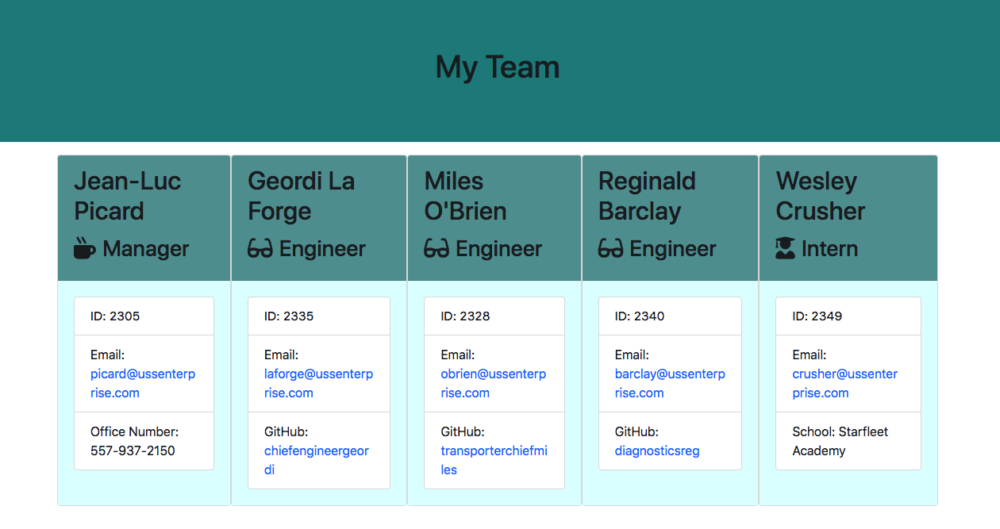
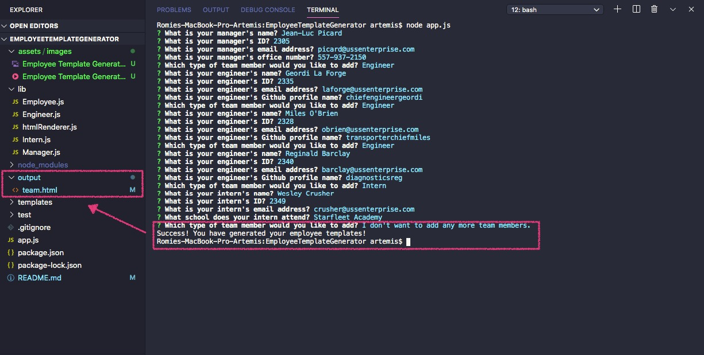
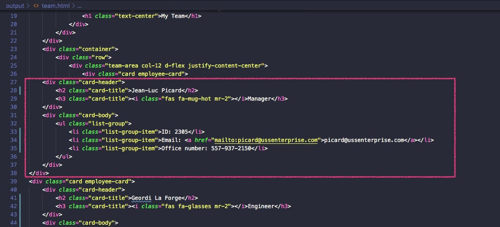
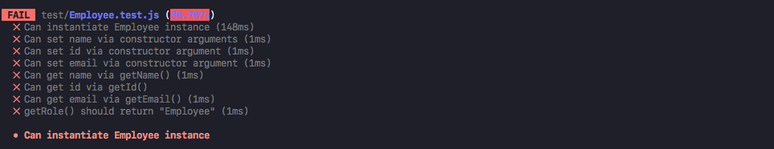
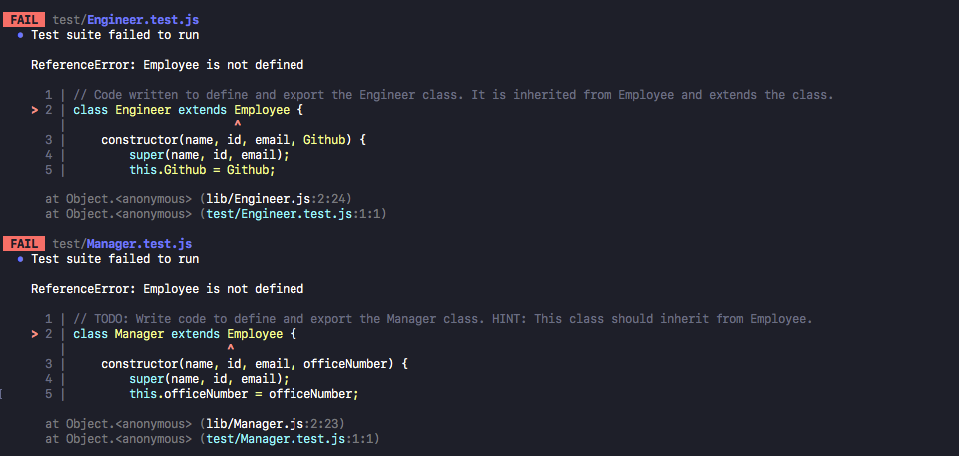

# Employee Template Generator

## Table of Contents
*  [Description](#description)
*  [User Story](#user-story)
*  [Features of the Application](#features-of-the-application)
*  [Preview of Employee Template Generator](#preview-of-employee-template-generator)
*  [Links](#links)
*  [Installation](#installation)
*  [Usage](#usage)
*  [License](#license)
*  [Tests](#tests)
*  [Contributing](#contributing)
*  [Questions](#questions)

## Description

The client requests the creation of a command line application that is capable of generating employee templates - that also includes basic contact information for each member of the team - based on a user's input. The node command line interface would also render the inputted information onto a new HTML page that one can easily access.

When launched, the application prompts the user for information about the team manager and then information about the individual team members. The user can input any number of team members - a mixture of engineers and interns - to fit their needs. Summaries for each employee is rendered onto the HTML page. In conjunction with creating the node application, multiple tests were run (using the jest dependency) to ensure that the code was maintainable.

## User Story
~~~
AS A manager   
I WANT to generate a webpage that displays my team's basic information  
SO THAT I can have quick access to emails and Github profiles.
~~~

## Features of the Application
~~~
GIVEN a command-line application that accepts user input  
WHEN I am prompted for basic information about my team members  
THEN a file is rendered with each team member's basic information, such as their name, role, school information, Github username, and office number.
~~~

## Preview of Employee Template Generator

The command line application renders an HTML page with summaries for each employee:

The following animation demonstrates the application functionality:

The following image demonstrates the application functionality and provide a closer look at the user output being generated:

The following image shows the user input from the node application being pushed into the ``team.html`` file:

## Links

[Github Repository](https://github.com/rh9891/EmployeeTemplateGenerator)

## Installation

The application requires the following dependencies and/or package managers:
~~~
npm install inquirer
~~~

## Usage

An example of usage when first launching the application to access the application from the command line:
~~~
node app.js
~~~

## License

This application does not currently have any licenses.

The user is not permitted to use, modify, or share any parts of it. Though the code for this application is hosted on Github, where you are allowed to view and fork the code, this does not imply that the user is permitted to use, modify, or share the contents of this application for any purpose.

## Tests

The tests for this application - which helped to build the necessary classes - were run (with [Jest](https://jestjs.io/docs/en/getting-started)) using the command:
~~~
npm run test
~~~

### Breakdown and Examples of Tests 

The tests for this application looked at the constructors of the application (employee, manager, engineer, and intern) and verified that certain arguments and methods were coded correctly to get an expected result.

The following images demonstrate the failed tests of the application and where the failures occurred in the program:

The following animation demonstrates the application passing the tests for all four constructors:

## Contributing

If you would like to contribute to this repository, please contact me via [Github](https://github.com/rh9891).

## Questions

If you have any questions, comments, or issues regarding this command line interface application, please do not hesitate to contact me via [Github](https://github.com/rh9891).